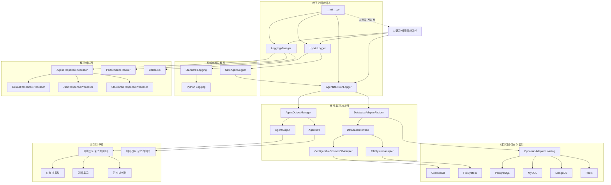
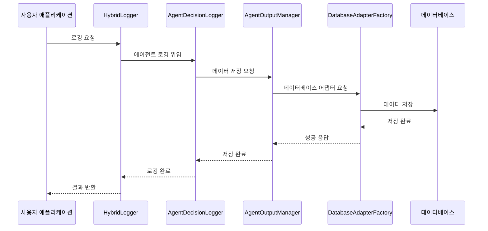

# Agent Logger - 범용 AI 에이전트 로깅 시스템

[](https://www.python.org/downloads/)
[](LICENSE)
[]()

## 📋 목차

- [개요](#-개요)
- [주요 기능](#-주요-기능)
- [시스템 아키텍처](#-시스템-아키텍처)
- [설치 및 설정](#-설치-및-설정)
- [사용법](#-사용법)
- [고급 기능](#-고급-기능)
- [API 문서](#-api-문서)
- [예제](#-예제)
- [시스템 작동 방식](#-시스템-작동-방식)
- [기여하기](#-기여하기)
- [라이선스](#-라이선스)

## 🎯 개요

Agent Logger는 AI 에이전트의 모든 활동을 체계적으로 기록하고 분석할 수 있는 범용 로깅 시스템입니다. 다양한 데이터베이스 지원, 비동기 처리, 성능 모니터링 등 엔터프라이즈급 기능을 제공합니다.

### 핵심 특징

- 🔄 **하이브리드 로깅**: 표준 Python 로깅과 커스텀 에이전트 로깅의 통합
- 🗄️ **다중 데이터베이스 지원**: CosmosDB, PostgreSQL, MySQL, MongoDB, Redis, SQLite, FileSystem
- ⚡ **비동기 처리**: 고성능 비동기 로깅으로 시스템 성능 최적화
- 📊 **성능 분석**: 실시간 성능 메트릭 추적 및 인사이트 생성
- 🛡️ **안정성**: 다중 폴백 시스템으로 안정적인 로깅 보장
- 🔧 **설정 기반**: 환경에 맞는 유연한 구성 가능
- 🧠 **학습 인사이트**: 에이전트 패턴 분석 및 개선 권장사항 생성

## 🚀 주요 기능

### 1. 에이전트 활동 로깅
- 에이전트 결정 과정 기록
- 입력/출력 데이터 저장
- 추론 과정 및 실행 단계 추적
- 성능 메트릭 수집

### 2. 다중 데이터베이스 지원
```python
# 지원하는 데이터베이스
- Azure CosmosDB
- PostgreSQL
- MySQL
- MongoDB
- Redis
- SQLite
- FileSystem (기본)
```

### 3. 학습 인사이트 생성
- 에이전트 패턴 분석
- 성능 트렌드 분석
- 개선 권장사항 생성
- 시스템 건강도 평가

### 4. 비동기 처리
- 비동기 로깅으로 성능 최적화
- 콜백 시스템 지원
- 실시간 성능 모니터링

### 5. 안전한 로깅
- 인코딩 오류 자동 처리
- 파일 시스템 오류 대응
- 메모리 캐싱으로 성능 최적화

## 🏗️ 시스템 아키텍처



## 📦 설치 및 설정

### 기본 설치

```bash
# 저장소 클론
git clone https://github.com/your-repo/agent_logger.git
cd agent_logger

# 의존성 설치
pip install -r requirements.txt
```

### requirements.txt

```txt
# 기본 의존성
dataclasses>=0.6; python_version < "3.7"
typing-extensions>=4.0.0

# 데이터베이스 어댑터 (선택사항)
azure-cosmos>=4.0.0  # CosmosDB
psycopg2-binary>=2.9.0  # PostgreSQL
pymongo>=4.0.0  # MongoDB
redis>=4.0.0  # Redis
sqlite3  # Python 내장

# 비동기 처리
asyncio  # Python 내장

# 유틸리티
python-dateutil>=2.8.0
```

### 환경 설정

```python
# config.py
LOGGING_CONFIG = {
    # 기본 설정
    'database_type': 'filesystem',  # 또는 'cosmos', 'postgresql' 등
    'filesystem_path': './agent_logs',
    
    # CosmosDB 설정 (선택사항)
    'cosmos_config': {
        'endpoint': 'your-cosmos-endpoint',
        'key': 'your-cosmos-key',
        'database_name': 'agent_logs',
        'container_name': 'agent_outputs'
    },
    
    # 성능 설정
    'max_response_length': 10000,
    'error_threshold': 0.1,
    
    # 로깅 설정
    'disable_file_logging': False,
    'response_processor': 'default'  # 'json', 'structured'
}
```

## 💻 사용법

### 1. 기본 로깅

```python
from agent_logger import AgentDecisionLogger

# 로거 초기화
logger = AgentDecisionLogger()

# 에이전트 출력 로깅
output_id = logger.log_agent_real_output(
    agent_name="AnalysisAgent",
    agent_role="데이터 분석가",
    task_description="고객 데이터 분석",
    final_answer="분석 완료: 85% 만족도",
    reasoning_process="데이터 패턴 분석을 통해 고객 만족도 추정",
    execution_steps=["데이터 로드", "전처리", "분석", "결과 생성"],
    performance_metrics={"processing_time": 2.5, "accuracy": 0.85}
)

print(f"로그 저장 완료: {output_id}")
```

### 2. 하이브리드 로깅

```python
from agent_logger import HybridLogger

# 하이브리드 로거 초기화
logger = HybridLogger("MySystem")

# 표준 로깅
logger.info("시스템 시작")
logger.warning("메모리 사용량 높음")

# 에이전트 결정 로깅
logger.log_agent_decision(
    agent_name="DecisionAgent",
    agent_role="의사결정 에이전트",
    input_data={"user_input": "주식 투자 조언"},
    decision_process={"analysis": "시장 분석", "risk_assessment": "위험 평가"},
    output_result={"recommendation": "매수", "confidence": 0.8},
    reasoning="시장 동향과 기술적 분석 결과"
)
```

### 3. 비동기 로깅

```python
import asyncio
from agent_logger import LoggingManager, HybridLogger

async def main():
    # 로거 및 매니저 초기화
    logger = HybridLogger()
    manager = LoggingManager(logger)
    
    # 비동기 응답 로깅
    response_id = await manager.log_agent_response(
        agent_name="AsyncAgent",
        agent_role="비동기 처리기",
        task_description="대용량 데이터 처리",
        response_data={"processed_items": 1000, "status": "success"},
        metadata={"batch_size": 100, "priority": "high"}
    )
    
    print(f"비동기 로깅 완료: {response_id}")

# 실행
asyncio.run(main())
```

### 4. 데이터베이스 설정

```python
# CosmosDB 설정
cosmos_config = {
    'database_type': 'cosmos',
    'cosmos_config': {
        'endpoint': 'https://your-cosmos-account.documents.azure.com:443/',
        'key': 'your-primary-key',
        'database_name': 'agent_logs',
        'container_name': 'agent_outputs'
    }
}

logger = AgentDecisionLogger(cosmos_config)

# PostgreSQL 설정
postgres_config = {
    'database_type': 'postgresql',
    'postgres_config': {
        'host': 'localhost',
        'port': 5432,
        'database': 'agent_logs',
        'user': 'username',
        'password': 'password'
    }
}

logger = AgentDecisionLogger(postgres_config)
```

## 🔧 고급 기능

### 1. 성능 모니터링

```python
from agent_logger import LoggingManager

manager = LoggingManager(logger)

# 성능 요약 조회
performance = manager.get_performance_summary("AnalysisAgent")
print(f"평균 응답 시간: {performance['avg_response_time']:.2f}초")
print(f"오류율: {performance['error_rate']:.2%}")

# 시스템 건강도 체크
health_report = manager.get_system_health_report()
print(f"시스템 상태: {health_report['overall_status']}")
```

### 2. 학습 인사이트

```python
# 에이전트별 학습 인사이트 조회
insights = logger.get_learning_insights("AnalysisAgent")

print("패턴 분석:")
for pattern in insights['patterns']:
    print(f"- {pattern['description']}")

print("개선 권장사항:")
for recommendation in insights['recommendations']:
    print(f"- {recommendation}")
```

### 3. 콜백 시스템

```python
def pre_log_callback(agent_name, response_data, metadata):
    print(f"로깅 전: {agent_name} 처리 중...")

def post_log_callback(agent_name, response_id, processed_response):
    print(f"로깅 완료: {agent_name} -> {response_id}")

# 콜백 등록
manager.register_pre_log_callback(pre_log_callback)
manager.register_post_log_callback(post_log_callback)
```

### 4. 커스텀 응답 프로세서

```python
from agent_logger.logging_manager import AgentResponseProcessor

class CustomResponseProcessor(AgentResponseProcessor):
    def process_response(self, response_data: Any) -> str:
        if isinstance(response_data, dict) and 'custom_field' in response_data:
            return f"커스텀 처리: {response_data['custom_field']}"
        return str(response_data)

# 커스텀 프로세서 적용
config = {'response_processor': CustomResponseProcessor()}
manager = LoggingManager(logger, config)
```

## 📚 API 문서

### AgentDecisionLogger

#### 주요 메서드

| 메서드 | 설명 | 반환값 |
|--------|------|--------|
| `log_agent_real_output()` | 에이전트 실제 출력 로깅 | `str` (output_id) |
| `log_agent_decision()` | 에이전트 결정 로깅 | `str` (decision_id) |
| `log_agent_interaction()` | 에이전트 간 상호작용 로깅 | `str` (interaction_id) |
| `get_learning_insights()` | 학습 인사이트 조회 | `Dict` |
| `get_all_previous_results()` | 이전 결과 조회 | `List[Dict]` |

### HybridLogger

#### 주요 메서드

| 메서드 | 설명 | 반환값 |
|--------|------|--------|
| `log_agent_decision()` | 에이전트 결정 로깅 | `str` |
| `log_agent_real_output()` | 에이전트 출력 로깅 | `str` |
| `log_processing_start()` | 처리 시작 로깅 | `str` |
| `log_quality_report()` | 품질 보고서 로깅 | `str` |

### LoggingManager

#### 주요 메서드

| 메서드 | 설명 | 반환값 |
|--------|------|--------|
| `log_agent_response()` | 비동기 에이전트 응답 로깅 | `str` |
| `get_performance_summary()` | 성능 요약 조회 | `Dict` |
| `get_system_health_report()` | 시스템 건강도 조회 | `Dict` |

## 📖 예제

### 예제 1: 간단한 에이전트 로깅

```python
from agent_logger import AgentDecisionLogger

def simple_agent_example():
    logger = AgentDecisionLogger()
    
    # 에이전트 작업 수행
    agent_name = "SimpleAgent"
    task = "텍스트 분석"
    result = "긍정적 감정 분석 완료"
    
    # 로깅
    output_id = logger.log_agent_real_output(
        agent_name=agent_name,
        agent_role="텍스트 분석가",
        task_description=task,
        final_answer=result,
        reasoning_process="감정 분석 알고리즘 적용",
        performance_metrics={"accuracy": 0.92, "processing_time": 1.2}
    )
    
    print(f"작업 완료: {output_id}")

if __name__ == "__main__":
    simple_agent_example()
```

### 예제 2: 다중 에이전트 워크플로우

```python
import asyncio
from agent_logger import LoggingManager, HybridLogger

async def multi_agent_workflow():
    logger = HybridLogger("WorkflowSystem")
    manager = LoggingManager(logger)
    
    # 1단계: 데이터 수집
    await manager.log_agent_response(
        agent_name="DataCollector",
        agent_role="데이터 수집기",
        task_description="웹 데이터 수집",
        response_data={"collected_items": 150, "sources": ["api1", "api2"]}
    )
    
    # 2단계: 데이터 처리
    await manager.log_agent_response(
        agent_name="DataProcessor",
        agent_role="데이터 처리기",
        task_description="데이터 전처리 및 정제",
        response_data={"processed_items": 145, "cleaned_data": True}
    )
    
    # 3단계: 분석
    await manager.log_agent_response(
        agent_name="DataAnalyzer",
        agent_role="데이터 분석가",
        task_description="통계 분석 수행",
        response_data={"analysis_result": "유의미한 상관관계 발견", "confidence": 0.87}
    )
    
    # 워크플로우 완료 로깅
    await manager.log_workflow_completion(
        workflow_name="데이터 분석 워크플로우",
        steps_completed=3,
        total_steps=3,
        workflow_result={"success": True, "total_processing_time": 15.3}
    )

# 실행
asyncio.run(multi_agent_workflow())
```

### 예제 3: 성능 모니터링 대시보드

```python
from agent_logger import LoggingManager, HybridLogger
import time

def performance_monitoring_dashboard():
    logger = HybridLogger("MonitoringSystem")
    manager = LoggingManager(logger)
    
    # 여러 에이전트 작업 시뮬레이션
    agents = ["AgentA", "AgentB", "AgentC"]
    
    for agent in agents:
        # 작업 수행 시뮬레이션
        start_time = time.time()
        time.sleep(0.1)  # 작업 시뮬레이션
        processing_time = time.time() - start_time
        
        # 로깅
        manager.log_agent_response(
            agent_name=agent,
            agent_role="테스트 에이전트",
            task_description="성능 테스트",
            response_data={"test_result": "success"},
            metadata={"processing_time": processing_time}
        )
    
    # 성능 요약 출력
    print("=== 성능 모니터링 대시보드 ===")
    for agent in agents:
        performance = manager.get_performance_summary(agent)
        print(f"{agent}:")
        print(f"  - 평균 응답 시간: {performance['avg_response_time']:.3f}초")
        print(f"  - 총 요청 수: {performance['total_requests']}")
        print(f"  - 오류율: {performance['error_rate']:.2%}")
        print()

if __name__ == "__main__":
    performance_monitoring_dashboard()
```

## 🔍 시스템 작동 방식

### 1. 데이터 흐름



### 2. 컴포넌트 상호작용

#### AgentDecisionLogger
- **역할**: 에이전트 활동의 메인 로거
- **기능**: 
  - 세션 기반 로깅 관리
  - 데이터 구조화 및 검증
  - 학습 인사이트 생성
- **작동 방식**:
  1. 세션 ID 생성
  2. 입력 데이터 검증
  3. AgentOutputManager로 저장 위임
  4. 성능 메트릭 수집

#### HybridLogger
- **역할**: 표준 로깅과 에이전트 로깅의 통합
- **기능**:
  - 이중 로깅 (표준 + 에이전트)
  - 안전한 로깅 (오류 복구)
  - 설정 기반 초기화
- **작동 방식**:
  1. 표준 Python 로거로 기본 로깅
  2. AgentDecisionLogger로 상세 로깅
  3. 오류 발생 시 콘솔 출력으로 대체

#### LoggingManager
- **역할**: 비동기 로깅 및 성능 관리
- **기능**:
  - 비동기 로깅 처리
  - 응답 데이터 전처리
  - 성능 추적 및 모니터링
- **작동 방식**:
  1. 비동기 실행자로 로깅 처리
  2. 응답 프로세서로 데이터 전처리
  3. 성능 메트릭 수집 및 분석

### 3. 데이터베이스 어댑터 시스템

#### DatabaseAdapterFactory
- **역할**: 다양한 데이터베이스 지원을 위한 팩토리
- **지원 데이터베이스**:
  - Azure CosmosDB
  - PostgreSQL/MySQL
  - MongoDB/Redis
  - SQLite/FileSystem
- **작동 방식**:
  1. 설정 기반 어댑터 선택
  2. 동적 어댑터 로딩
  3. 연결 실패 시 FileSystem으로 폴백

#### ConfigurableCosmosDBAdapter
- **역할**: CosmosDB 연결의 다양한 방식 지원
- **연결 방식**:
  - 직접 연결 정보
  - 모듈 경로 기반
  - 팩토리 함수
  - 기존 인스턴스

### 4. 성능 최적화

#### 메모리 캐싱
- 최근 로그 데이터 메모리 캐싱
- 캐시 크기 자동 관리
- 메모리 사용량 모니터링

#### 비동기 처리
- 로깅 작업의 비동기 실행
- 성능 병목 최소화
- 시스템 응답성 향상

#### 안전한 로깅
- 인코딩 오류 자동 처리
- 파일 시스템 오류 대응
- 다중 폴백 시스템

### 5. 학습 인사이트 시스템

#### 패턴 분석
- 에이전트 활동 패턴 식별
- 성능 트렌드 분석
- 이상 패턴 감지

#### 개선 권장사항
- 성능 기반 권장사항 생성
- 시스템 최적화 제안
- 에이전트 튜닝 가이드

## 🤝 기여하기

프로젝트에 기여하고 싶으시다면 다음 단계를 따라주세요:

1. 이 저장소를 포크합니다
2. 새로운 기능 브랜치를 생성합니다 (`git checkout -b feature/amazing-feature`)
3. 변경사항을 커밋합니다 (`git commit -m 'Add amazing feature'`)
4. 브랜치에 푸시합니다 (`git push origin feature/amazing-feature`)
5. Pull Request를 생성합니다

### 개발 환경 설정

```bash
# 개발 의존성 설치
pip install -r requirements-dev.txt

# 테스트 실행
python -m pytest tests/

# 코드 스타일 검사
flake8 agent_logger/
black agent_logger/
```

### requirements-dev.txt

```txt
# 개발 의존성
pytest>=7.0.0
pytest-asyncio>=0.21.0
flake8>=5.0.0
black>=22.0.0
mypy>=1.0.0
```

## 📄 라이선스

이 프로젝트는 MIT 라이선스 하에 배포됩니다. 자세한 내용은 [LICENSE](LICENSE) 파일을 참조하세요.

## 📞 지원

- **이슈 리포트**: [GitHub Issues](https://github.com/your-repo/agent_logger/issues)
- **문서**: [Wiki](https://github.com/your-repo/agent_logger/wiki)
- **이메일**: support@agent-logger.com

## 🙏 감사의 말

이 프로젝트는 다음과 같은 오픈소스 프로젝트들의 도움을 받았습니다:

- [Python Logging](https://docs.python.org/3/library/logging.html)
- [Azure Cosmos DB](https://azure.microsoft.com/services/cosmos-db/)
- [PostgreSQL](https://www.postgresql.org/)
- [MongoDB](https://www.mongodb.com/)

---

**Agent Logger** - AI 에이전트의 모든 활동을 체계적으로 기록하고 분석하세요! 🚀 